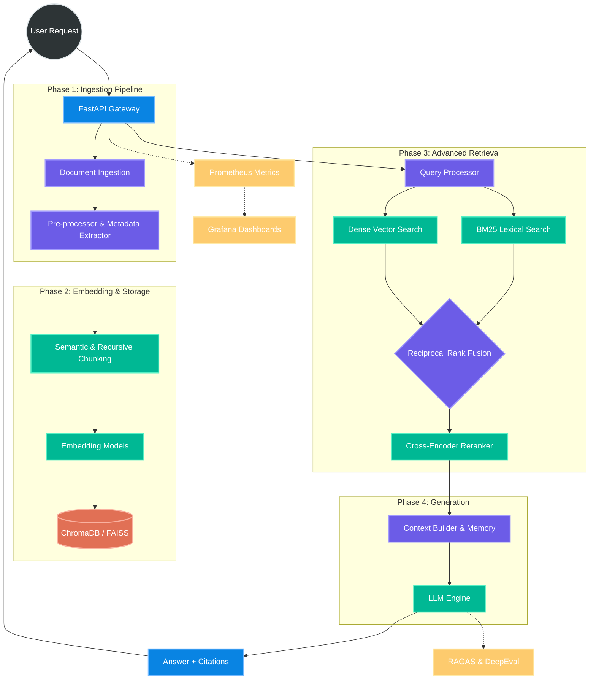

# RAGX — Advanced Retrieval and Generation Engine

<p align="center">
  <strong>A Production-Grade, Scalable, and Extensible RAG Platform Built for Enterprise AI Applications</strong>
</p>

<p align="center">
  <a href="https://docs.python.org/3/" target="_blank"></a>
  <a href="https://microservices.io/" target="_blank"></a>
  <a href="https://python.langchain.com/" target="_blank"></a>
  <a href="https://fastapi.tiangolo.com/" target="_blank"></a>
  <a href="https://docs.docker.com/" target="_blank"></a>
</p>

---

## 📖 Project Overview

**RAGX** is an end-to-end Retrieval-Augmented Generation (RAG) engine designed with senior software engineering and ML-Ops best practices. Built to solve the limitations of standard naive RAG pipelines, RAGX introduces **hybrid search**, **contextual compression**, **cross-encoder reranking**, and **multi-agent generation capabilities** into a unified, modular architecture.

Whether deploying a semantic search engine over million-document corporate wikis, or building highly contextual conversational AI, RAGX provides the necessary data-ingestion scalability, retrieval precision, and generation safeguards to confidently push AI to production.

---

## 🏛️ System Architecture

RAGX is strictly decoupled into 5 operational phases using the **Factory** and **Strategy** design patterns, allowing developers to seamlessly swap out underlying ML models, vector databases, and retrieval logic without touching core application code.



---

## 🧠 Core Engineering & AI Capabilities

### 1. Robust Data Ingestion & Preprocessing
* **Multi-Format Extractor:** Asynchronous parsers for PDF, DOCX, TXT, CSV, Markdown, and Web Scrapes.
* **Intelligent Cleaning:** Automated header/footer stripping, Unicode normalization, and structural preservation.
* **Deterministic Tracking:** SHA-256 content hashing to prevent duplicate vector ingestion.

### 2. High-Dimensional Embeddings
* **Adaptive Chunking:** Utilizes both statistical (Recursive Character Splitter) and NLP-driven (Semantic Chunker) algorithms to maintain context boundaries.
* **Provider Agnosticism:** Factory patterns allow hot-swapping between `OpenAI`, `BGE`, and local `SentenceTransformers` via environment variables.

### 3. Precision Retrieval Engine (The RAGX Differentiator)
* **Hybrid Search Implementation:** Merges Sparse (BM25) and Dense (Similarity) retrieval using Reciprocal Rank Fusion (RRF), ensuring exact-keyword matching doesn't get lost in semantic space.
* **Cross-Encoder Reranking:** Re-evaluates the top-K retrieved chunks against the original query using `ms-marco-MiniLM` or `Cohere`, pushing the most highly correlated context to the top.
* **Advanced Query Strategies:** Implements Parent-Child chunk retrieval and Query Expansion (Multi-Query).

### 4. Anti-Hallucination Generation
* **Grounded Prompts:** Strict system prompts forcing the LLM to only utilize provided context.
* **Citation Traceability:** Automatically extracts source documents, page numbers, and UUIDs to provide transparent, auditable answers.
* **Multi-LLM Support:** Seamlessly integrated with Google Gemini, OpenAI GPT-4o, Anthropic Claude, and Local Ollama models.

### 5. Production-Ready MLOps
* **Type Safety:** 100% strictly typed Python (mypy) with Pydantic-enforced configuration models.
* **Monitoring:** Pre-instrumented with Prometheus and visualized via Dockerized Grafana dashboards.
* **Continuous Evaluation:** Integrated `RAGAS` and `DeepEval` frameworks to continuously benchmark Faithfulness, Answer Relevance, and Context Precision.

---

## 🚀 Future Scope & Business Applications

RAGX is not just a coding experiment—it is a foundational blueprint that can be rapidly extended to solve high-value enterprise problems:

1. **Automated Legal & Compliance Analysis**
   * *Use Case:* Ingesting thousands of regulatory PDFs to allow legal teams to instantly query compliance constraints.
   * *Future Feature:* Add GraphRAG (Knowledge Graphs) to RAGX to map relationships between distinct corporate entities and legal clauses.

2. **Enterprise Technical Support (DevOps Agent)**
   * *Use Case:* Indexing massive internal documentation hubs (Confluence, Jira, GitHub) to instantly solve developer blockers.
   * *Future Feature:* Agentic Tool Calling—allowing the RAGX LLM to not only answer questions but also execute bash scripts or query databases on behalf of the user.

3. **Hyper-Personalized Healthcare Triage**
   * *Use Case:* Searching through anonymized clinical trials and medical journals to assist practitioners in diagnosis.
   * *Future Feature:* HIPAA-compliant on-premise deployment via Kubernetes, utilizing completely localized LLMs (like LLaMA 3 via Ollama) and vector databases.

---

## 🛠️ Quick Start Guide

We recommend using **`uv`** (an ultra-fast Python manager written in Rust) to bypass common C-library compilation issues on host machines.

### 1. System Setup
```bash
# Install uv
curl -LsSf https://astral.sh/uv/install.sh | sh

# Clone RAGX
git clone https://github.com/genius-0963/RAGX-Advanced-Retrieval-and-Generation-Engine.git
cd RAGX-Advanced-Retrieval-and-Generation-Engine

# Create a clean environment and install dependencies in seconds
uv venv --python 3.12 .venv
source .venv/bin/activate
uv pip install -e ".[dev]"
```

### 2. Configuration
Create a `.env` file from the example template. By default, RAGX is configured for **Google Gemini** (Generation) and **Sentence Transformers** (Local Embeddings).
```bash
cp .env.example .env
# Edit .env and insert your API Key:
# GOOGLE_API_KEY=your_key_here
```

### 3. Verify Integration (End-to-End Test)
Run the built-in testing suite to verify all ML components (Ingestion → VectorDB → Retrieval → Generation) are communicating correctly:
```bash
python test_run.py
```

### 4. Deploy the FastAPI Gateway
Launch the asynchronous REST API server:
```bash
uvicorn ragx.api.main:app --reload --host 0.0.0.0 --port 8000
```
*Visit `http://localhost:8000/docs` to view the interactive OpenAPI specification.*

---

## 🐳 Dockerized Infrastructure

Deploy the entire microservice stack (API Gateway, Prometheus, Grafana, and Vector Database) in a single command:

```bash
make docker-build
make docker-up
```

---

<p align="center">
  <i>Designed and engineered with strict software architecture principles to push the boundaries of Applied AI.</i>
</p>
